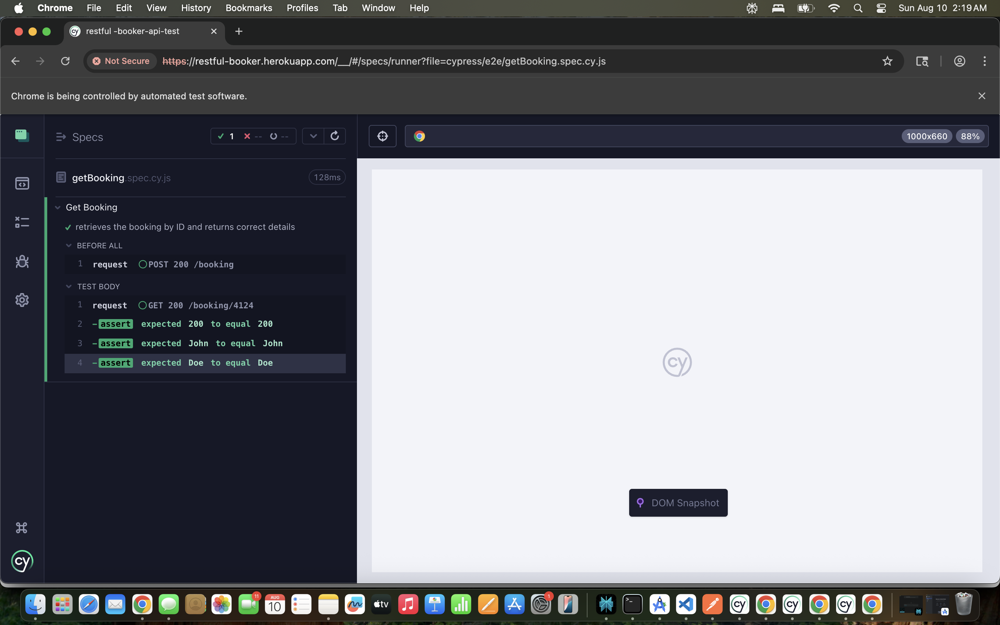
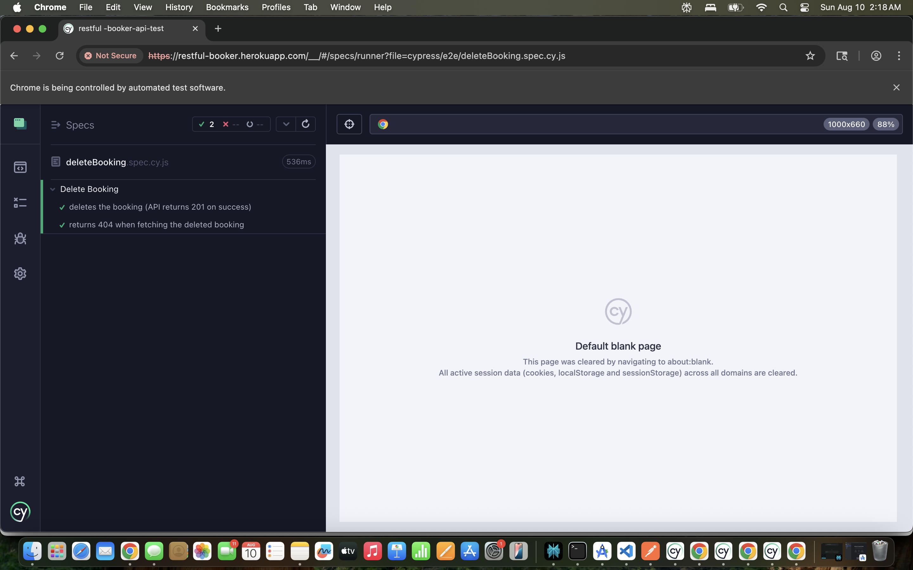

# Cypress API Testing Project – Restful-Booker API

## 🎯 Project Demonstration

This project uses **Cypress** to automate RESTful API testing for the [Restful-Booker API](https://restful-booker.herokuapp.com/).  
It covers key CRUD operations: Create, Retrieve, Update, and Delete bookings, plus a health check test.

---

## 🛠 Tools & Environment
- **Cypress** for automation testing  
- **JavaScript** for writing tests  
- **Restful-Booker API** for endpoint testing  
- **MacOS** with VS Code as IDE  

---

## ✅ Tests Performed

### **1. Health Check Test**
- **Endpoint:** `GET /ping`  
- **Purpose:** Verify API is operational  
- **Result:** ✔ Passed (Status code `201 Created` returned correctly)  

---

### **2. Create Booking**
- **Endpoint:** `POST /booking`  
- **Payload:** JSON body with booking details  
- **Result:** ✔ Passed (Booking successfully created, `200 OK` status)  

---

### **3. Get Booking**
- **Endpoint:** `GET /booking/{id}`  
- **Purpose:** Fetch details of an existing booking  
- **Result:** ✔ Passed (Correct booking details returned)  

---

### **4. Update Booking (PUT)**
- **Endpoint:** `PUT /booking/{id}`  
- **Purpose:** Modify booking details  
- **Result:** ✔ Passed (Booking updated successfully)  

.png)

---

### **5. Delete Booking**
- **Endpoint:** `DELETE /booking/{id}`  
- **Purpose:** Remove a booking  
- **Result:** ✔ Passed (Booking deleted successfully)  

## 🎥 Project Demonstration
📌 **Screen Recording of All Tests**: [Click Here to View] https://drive.google.com/file/d/1ifrEzj2wraYle65LoIx0T5sbFldobAKB/view?usp=sharing

---

